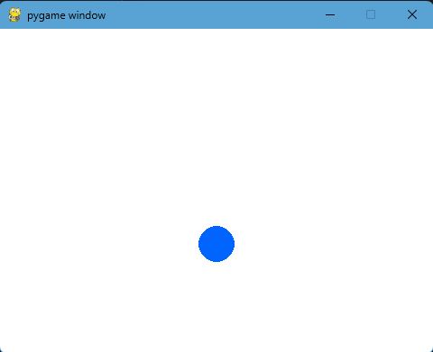
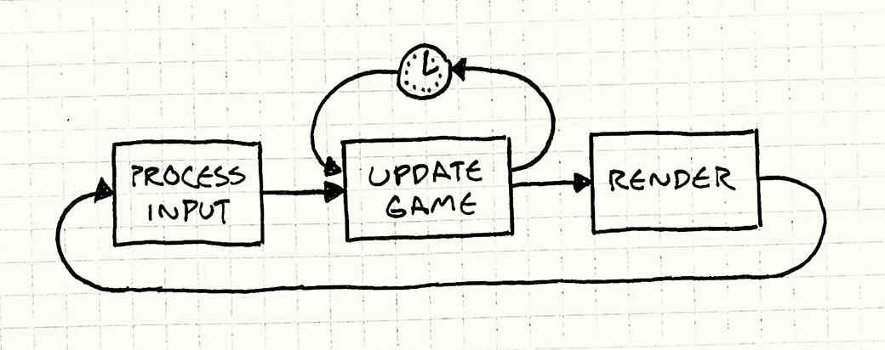
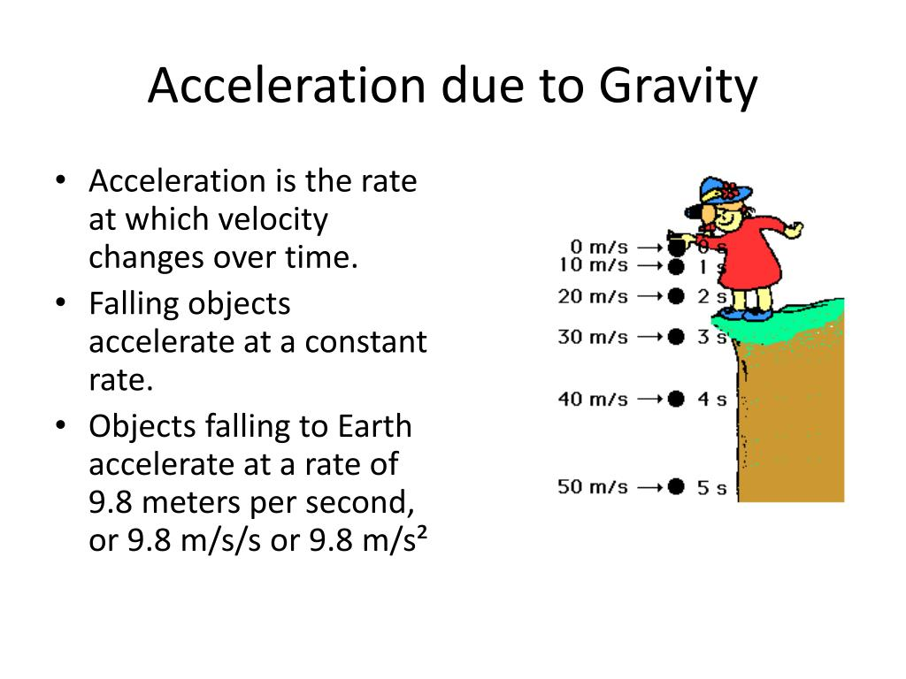

## Lesson 2: Bouncing Ball in Pygame

### What Does This Program Do?

#### This program draws a blue ball that falls from the top of the screen, bounces off the floor, and eventually comes to rest, just like a real ball!

</img>

## Lets break down some important concepts this program demonstrates:

### The Game Loop

```python
while running:
    screen.fill(COLOR_WHITE)
    # update, draw, flip
    clock.tick(DISPLAY_FPS)
```

</img>

#### Every game runs a loop that repeats (our game is ~10 times per second) aka 10 fps. Each pass through the loop is one frame. Each frame we:

1. Clear the screen
2. Update positions
3. Draw everything
4. Show the new frame

### Physics Variables

```python
ball_velocity_y = 0
gravity = 0.5
```

#### Velocity is how fast the ball moves. Gravity is added to velocity every frame, making the ball speed up as it falls just like real gravity!

```python
ball_velocity_y += gravity      # Ball speeds up
ball_pos[1] += ball_velocity_y  # Ball moves down
```

</img>

### Bouncing Logic

```python
ball_velocity_y *= ball_bounce_factor  # -0.7
```

#### When the ball hits the floor, we multiply velocity by -0.7. The negative flips direction (up instead of down), and 0.7 reduces speed. After several bounces the speed gets so small we just stop it:

```python
if abs(ball_velocity_y) < 1:
    ball_velocity_y = 0
```

### Drawing

```python
pygame.draw.circle(screen, COLOR_BLUE, (x, y), radius)
pygame.display.flip()
```

#### draw.circle paints the ball. display.flip() reveals the finished frame, like flipping a page in a flipbook.

### Try It Yourself

- Change gravity to 1.5 what happens?
- Change ball_bounce_factor to -0.9 does it bounce longer?
- Change COLOR_BLUE to (255, 0, 0) what color appears?
