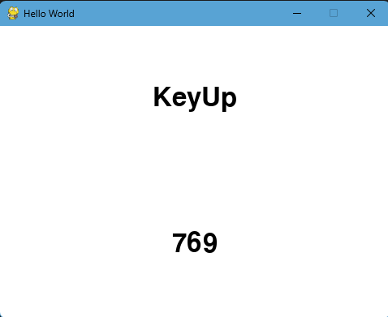
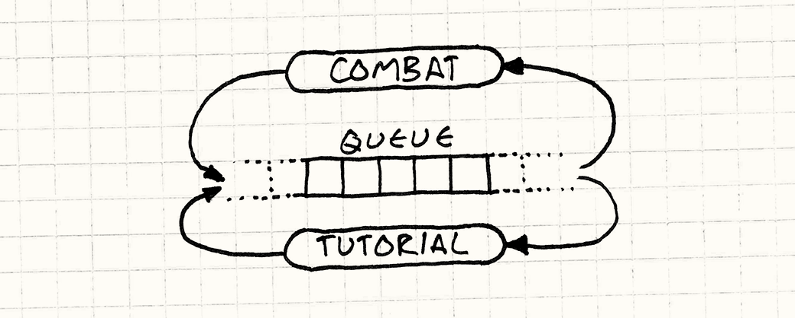

## Lesson 3: Input Polling in Pygame

### What Does This Program Do?

#### This program listens for **events** (like moving your mouse or pressing a key) and displays the event's name and type number on screen in real time.

</img>

## Lets break down some important concepts this program demonstrates:

### The Event Queue

```python
for event in pygame.event.get():
    print(pygame.event.event_name(event.type))
```

</img>

#### Every time you interact with the window via moving the mouse, pressing a key or clicking, Pygame logs it as an **event**. `pygame.event.get()` collects all events that happened since the last frame. We loop through each one and respond to it.

### Event Types

```python
event.type
pygame.event.event_name(event.type)
```

#### Every event has a **type** _a number that identifies what happened_. `event.type` gives you the raw number (like `1024`). `event_name()` converts it to a readable label like `"MouseMotion"`. Both get displayed on screen so you can see exactly what Pygame is detecting.

### Surfaces & Rendering Text

```python
text_event = font.render("MouseMotion", True, COLOR_BLACK)
```

#### In Pygame, text isn't drawn directly; it's first rendered onto a **Surface** (think of it as a small image of the text). `font.render()` takes three things: the string to display, antialiasing (`True` = smooth edges), and the color.

### Blitting (Placing Things on Screen)

```python
text_rect = text_event.get_rect(center=(width // 2, height // 4))
screen.blit(text_event, text_rect)
```

#### **Blit** means "copy this surface onto the screen at this position." We use `.get_rect(center=...)` to automatically center the text at a specific coordinate, rather than guessing x/y manually.

### The QUIT Event

```python
if event.type == pygame.QUIT:
    running = False
```

#### When the user clicks the X button, Pygame fires a `QUIT` event. We check for it and set `running = False` to exit the game loop cleanly, followed by `pygame.quit()` to shut everything down.

## Try It Yourself

- Move your mouse over the window — what event name appears?
- Click inside the window — do you see a different event?
- Press a key on the keyboard — what shows up?
- Can you find what `event.type` number belongs to `"KeyDown"`?
