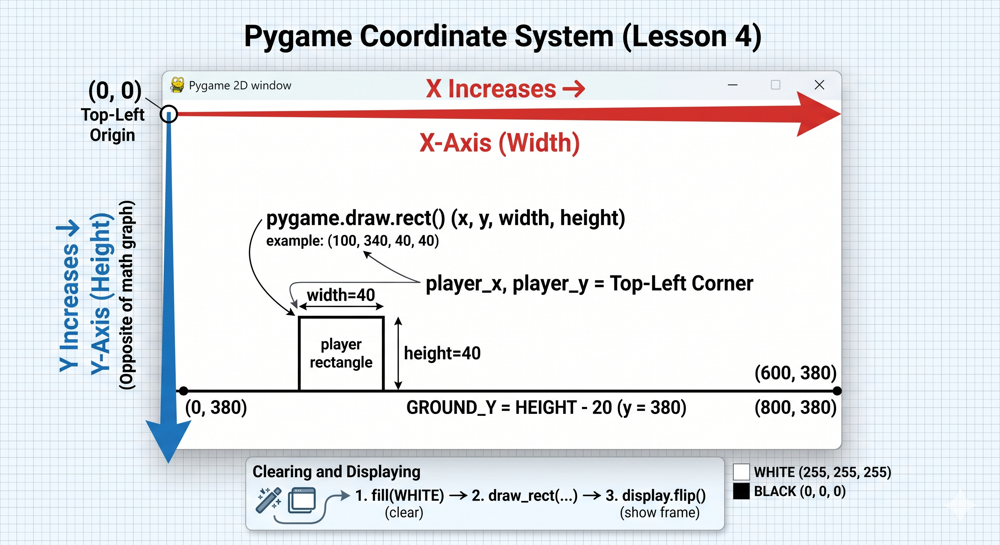
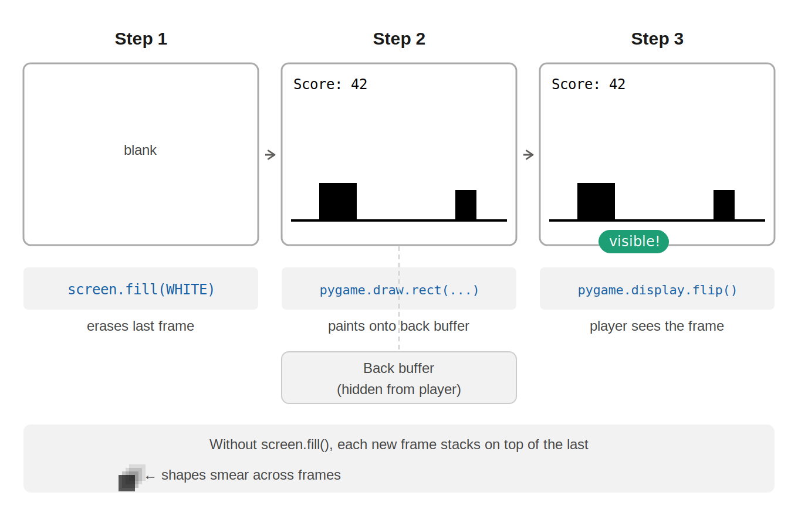

## Lesson 4: Drawing Shapes in Pygame

### What Does This Program Do?

#### This program draws a simple game scene: a white background, a black ground line, a player rectangle, and obstacle rectangles. These simple shapes are the exact building blocks we need to recreate the **No Internet Dinosaur Game**!

## Let's break down some important concepts this program demonstrates:

### The Screen Coordinate System

```python
WIDTH, HEIGHT = 800, 400
GROUND_Y = HEIGHT - 20   # 20 pixels from the bottom
```

</img>

#### In Pygame, **(0, 0) is the top-left corner** of your window.

Think of it like reading a page in a book: you start at the top-left.

- **X increases** as you move to the **right**.
- **Y increases** as you move **downward**.

This is the exact _opposite_ of the math graphs you use in school! Because our window is 400 pixels tall (`HEIGHT = 400`), a shape with a `y` value of `380` is going to be drawn very close to the bottom of the screen.

---

### RGB Colors

```python
WHITE = (255, 255, 255)  # all channels full = white
BLACK = (0, 0, 0)        # all channels off  = black
RED   = (255, 0, 0)      # only red is full
```

#### Computers mix light to create colors using an **RGB (Red, Green, Blue)** system.

Colors are written as three numbers inside parentheses called a _tuple_. Each number acts like a dimmer switch for a colored lightbulb, going from **0 (completely off)** to **255 (maximum brightness)**.

Because we are mixing _light_ instead of _paint_, turning all the colors to max (255, 255, 255) makes White. Turning them all off (0, 0, 0) makes Black. You can mix these numbers to create millions of different colors!

---

### Drawing Rectangles

```python
pygame.draw.rect(screen, BLACK, (player_x, player_y, 40, 40))
```

#### The `pygame.draw.rect()` command acts like a digital stamp for a filled rectangle.

To use it, you have to give the computer four specific instructions:

1.  **Where to draw it:** `screen` (this is our main game window).
2.  **What color:** `BLACK`.
3.  **The Shape Data:** A tuple of four numbers **(x, y, width, height)**.
    - The `x` and `y` tell Pygame where to place the **top-left corner** of the rectangle.
    - The last two numbers decide how wide and how tall the rectangle will be in pixels.

---

### Drawing Lines

```python
pygame.draw.line(screen, BLACK, (0, GROUND_Y), (WIDTH, GROUND_Y), 2)
```

#### The `pygame.draw.line()` command connects two dots with a straight line.

Instead of a width and height, a line needs a **start point** and an **end point**.

- **Start Point:** `(0, GROUND_Y)` starts the line at the far left edge of the screen.
- **End Point:** `(WIDTH, GROUND_Y)` stretches the line all the way to the far right edge.
- **Thickness:** The very last number (`2`) is the thickness of the line in pixels. If you leave this out, Pygame draws a super skinny 1-pixel line.

---

### Clearing and Displaying (The Game Loop)

```python
screen.fill(WHITE)         # 1. Erase the whiteboard
pygame.draw.rect(...)      # 2. Draw the new scene
pygame.display.flip()      # 3. Show the audience
```

</img>

#### Think of your game like a fast-moving flipbook or a whiteboard.

Every single fraction of a second (a frame), you must follow these three steps in order:

1.  **Clear:** Use `screen.fill()` to wipe the whiteboard clean. If you don't do this, your player will leave a giant smeared trail of shapes behind them as they move!
2.  **Draw:** Stamp your characters, grounds, and enemies onto the clean board.
3.  **Flip:** Use `pygame.display.flip()` to turn the screen around and show the final picture to the player.

## Try It Yourself!

Let's test what you've learned. Change the code in your file to see what happens:

- **Color Hacker:** Change the `WHITE` background to `(0, 0, 255)`. What color does the sky become?
- **Earthquake:** Change the ground line's starting `y` to `GROUND_Y - 50` but leave the ending `y` the same. What happens to the floor?
- **Growth Spurt:** Change the player's drawing tuple to `(player_x, player_y, 80, 80)`. Does the player grow? Does it look like they are still standing flat on the ground line?
