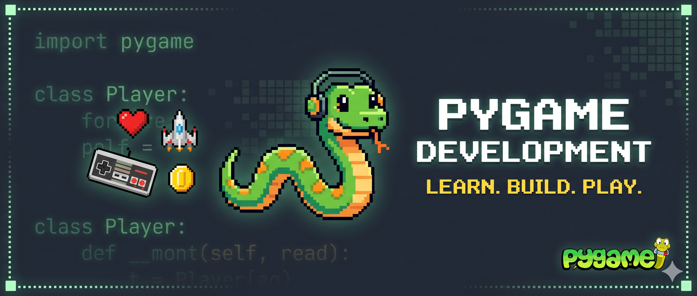

# HCPS Pygame Curriculum

</img>

**HCPS_Pygame_01** repository: This project contains the Pygame curricular development specifically designed for **HCPS**.

## Overview

This curriculum is tailored for 7th-grade students to learn foundational Python programming and logic through 2D game development. The lessons and code provided here are structured to be easily integrated and deployed on the **CodeHS** platform.

## Repo Structure

To keep the project clean and easy to navigate, the files are organized as follows:

- `docs/` - Contains the Markdown (`.md`) lesson files (e.g., _Lesson 4: Drawing Shapes_). These are the readable guides for the students and teacher aid.

- `Pygame_Lessons/` - Contains the Python scripts (`.py`), Visual Studio solution files (`.slnx`), that correspond to each lesson.

- `img/` - Holds any image assets and diagrams referenced in the markdown tutorials.

## Ready to Build?

To get started integrating these modules into CodeHS:

- **For Teaching & CodeHS Setup:** Head over to the `docs/` folder. You will find the step-by-step Markdown lessons that you can copy directly into your CodeHS text modules, or use as standalone teaching aids.
- **For Code Reference & Student Exercises:** Check out the `Pygame_Lessons/` folder. This contains the actual `.py` scripts so you can navigate the complete codebase, run the games locally, and grab the exercise scripts for your students.
