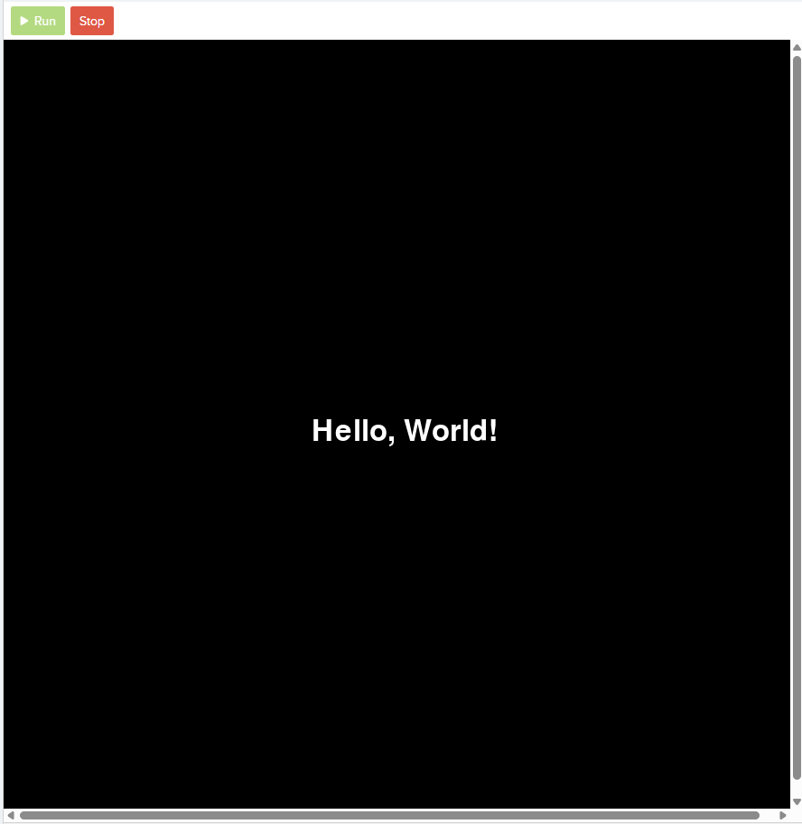

### Overview
<details>
    <summary>
    Lesson Summary
    </summary>

```
HCPS Pygame Curricular Project
Title: Lesson 01 - Hello World
Description: This lesson reviews foundational Pygame concepts by taking students
             through the development of a sample "Hello World" program in Pygame.
Author: Mark Dencler (mdencler@harford.edu)
Date: 2026-03-18
```
</details>

<!-- BEGIN - Sample Text and Code -->
When you start programming, it is traditional to write a "Hello World" program.  Here is what "Hello World"
looks like in Pygame.

<b>M01_Hello_World.py</b>
```py
import pygame
import sys

def main():
    # Initialize Pygame
    pygame.init()

    # Create window
    width, height = 480, 360
    screen = pygame.display.set_mode((width, height))
    pygame.display.set_caption("Hello World")

    # Set up font
    font = pygame.font.SysFont(None, 48)
    text = font.render("Hello, World!", True, (255, 255, 255))

    # Main loop
    running = True
    while running:
        # Handle events
        for event in pygame.event.get():
            if event.type == pygame.QUIT:
                running = False

        # Fill background
        screen.fill((0, 0, 0))

        # Draw text (centered)
        text_rect = text.get_rect(center=(width // 2, height // 2))
        screen.blit(text, text_rect)

        # Update display (page flip)
        pygame.display.flip()

# Clean up
pygame.quit()
sys.exit()
<!-- END - Sample Text and Code -->
```

Start by taking this script and running it in the CodeHS interactive environment.  Don't worry about what anything does yet.  Just copy and paste the text into the interactive sandbox and use the "▶RUN" button to observe the output.  Take note that you may have to click "STOP" and "▶RUN" a couple times to get the text to cetner on the screen.  Sometimes, during the initial run of a script, CodeHS will position elements incorrectly.  You can easily correct this issue by stopping and running the project one time.  Work until you are able to independently get things to run successfully, then we will begin breaking down the individual elements within the code to better understand how everything works.

<!-- IMAGE - M01_Hello_World - Sample Output -->
</img>

Let's start by breaking 